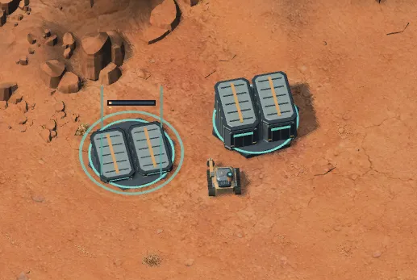

# Worker: offene Reproduktion und Liveness

## Nutzerberichte

Beim nacheinander gesetzten rechten/linken Logistics depot blieb der zweite Worker stehen; Karte/Seed/Position fehlen. Zweiter Bericht: zwei stehende Prospector zwischen HQ/Gebäude nahe Mineralfeld, ohne Zustandsabzug.

Isolierte HQ-/Depot-Prüfung belegte eine passende Fehlerklasse: wechselndes HQ-/Servicepunktziel und vorzeitig übersprungener Arbeitswegpunkt. Korrektur integriert, Originalscreenshots nicht exakt reproduziert. [Navigationsregressionen](../../../tests/ashes-of-meridian-navigation.check.cjs), [dauerhafter Vertrag](../../architecture.md#welt-darstellung-und-zufall).

## Noch offen

- [ ] Lokalen HQ-Fall `service tolerance does not extend the existing outer HQ delivery range` prüfen: Die erwartete Ablieferung im zweiten Worker-Aufruf bleibt aus (Ladung 18 statt 0), auch im isoliert gebauten unveränderten Stand `1e1d24a` vor der umlaufenden Forum-Regel. Ursache beziehungsweise Tickannahme offen; kein Nachweis einer durch das Forum eingeführten HQ-Regression und kein allgemeiner Langlaufbefund.
- [ ] Originalfälle bei erneutem Stillstand sichern: Karte/Seed, Workerposition/-auftrag/-fracht, Exit/Yield, kompletter Pfad samt Ziel/Status/Version, Stuck-/Recoverywerte und Nachbargeometrie. Vor Reload sichern; kein laufendes Restore.
- [ ] Sichtbarer Blockiert-/Ausgangswarten-Status oder abschließende Fehlerreaktion. Temporäre Belegung nicht als dauerhaft unerreichbar behandeln; keine heimlichen Erstattungen/Teleports.
- [ ] Auftragsweite Liveness statt nur Wegpunktfortschritt, Yield-/Umwegzyklen und Servicepunkt-Fairness/Gegenverkehr beurteilen.
- [ ] Größenabhängige Clearance, allgemeine Segmentkollision und globales Suchbudget nur als separate Erweiterung. Bestehende Radien/RNG schützen. Die [Performancearbeit](../mobile-performance.md#p1--identische-arbeit-wiederverwenden) verwendet Suchpuffer bereits wieder; Terrainwiederverwendung bleibt separat. Ein Live-Körperindex muss Reihenfolge, Exitreservierungen und sämtliche Positionsänderungen erhalten. Diese Optimierungen ersetzen keine Liveness-Abnahme.

Akzeptanz: erreichbarer Bau wird ohne Neuauftrag abgeschlossen, jeder erreichbare Minenworker liefert wiederholt; unerreichbare Ziele sind nachvollziehbar ohne Suchstürme. Höhenzugang darf Arbeit durch Klippen nicht erlauben.

Bestehende Langlauf-Ausnahme für künstlich gebündelte Startworker: erste Anlaufminute nur mit Abbaufortschritt, danach weiterhin Lieferung je Worker/Minute. Keine allgemeine Stillstandstoleranz. Crowd-/Originalfallabnahme bleibt offen; [Prüffreigaben](../../testing.md).
